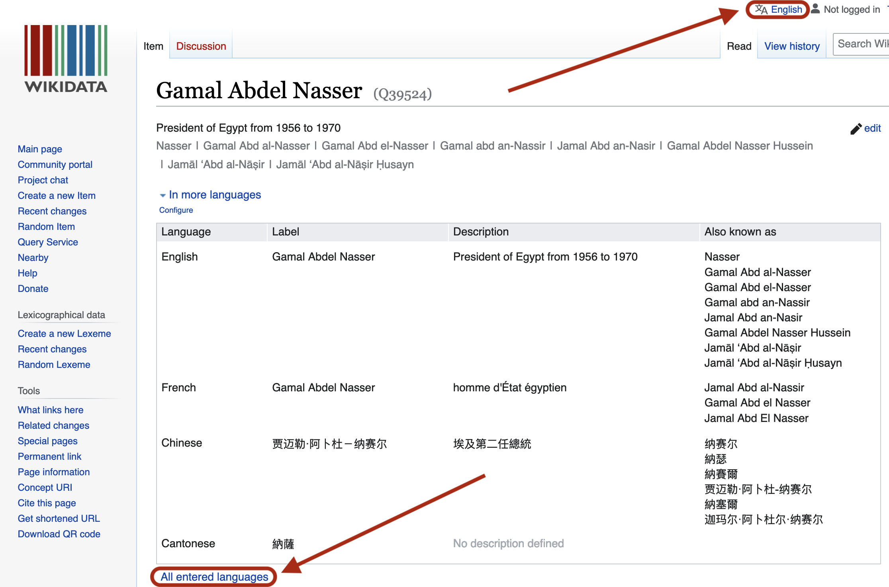
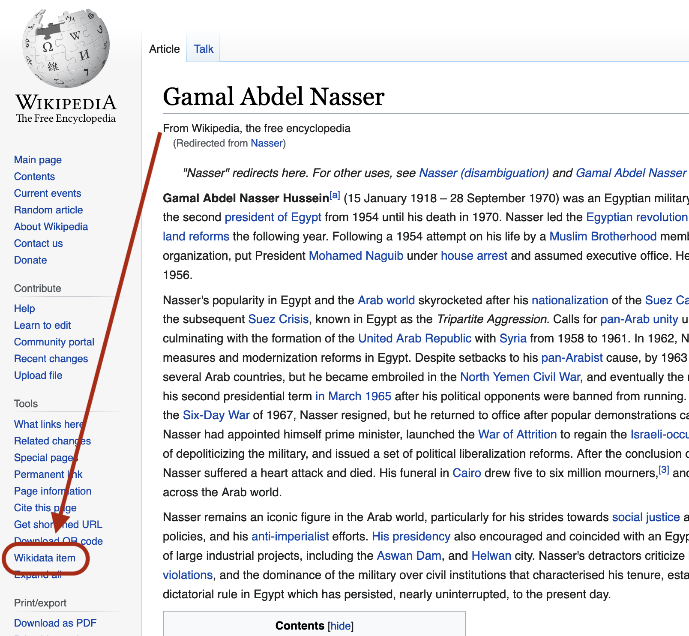
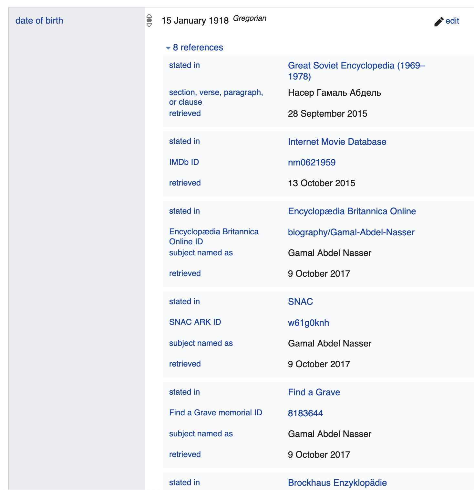
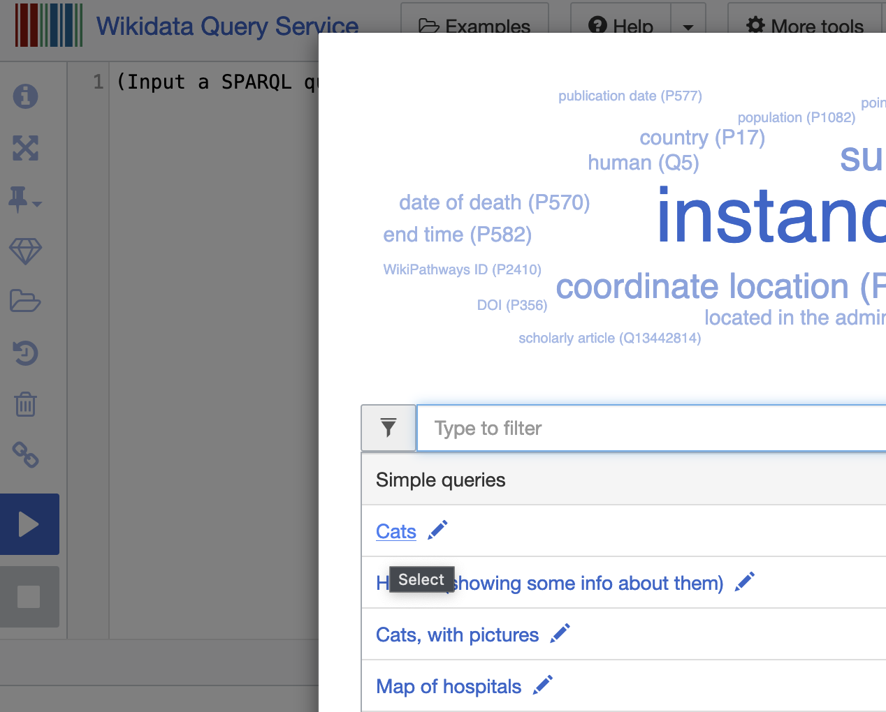
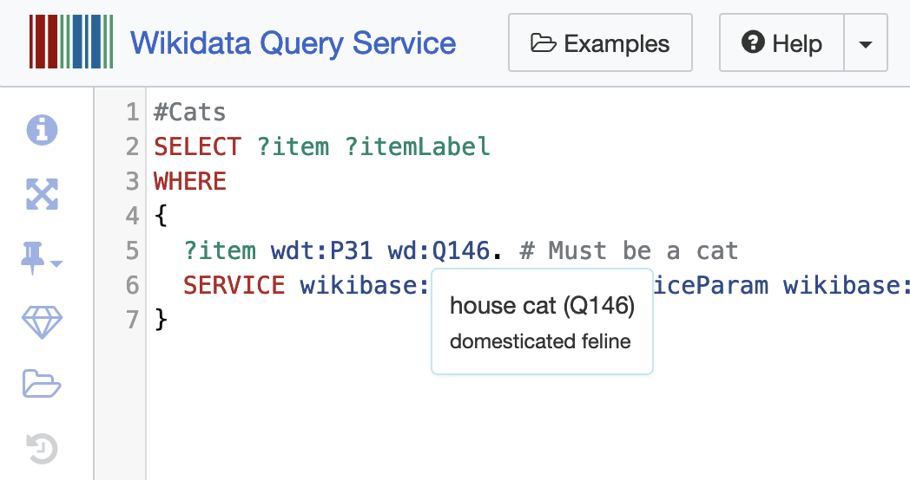



# Lesson Overview

In this lesson you will learn:
- what kinds of information Wikidata contains, 
- how to explore that data in order to contextualize questions in your historical research, and
- how to edit and add data in Wikidata to store your own data and share it with others.

While this stand-alone lesson focuses on Wikidata, it can also serve to extend your understanding of Linked Open Data. Wikidata is the most user-friendly implementation of this data structure, and it's under constant development. It's a great place to learn about key graph data features, such as schemas and the SPARQL query language, which can be applied in other contexts. After--or before--completing this lesson, users might wish to read Jonathan Blaney's [Introduction to the Principles of Linked Open Data](https://programminghistorian.org/en/lessons/intro-to-linked-data), which covers some of the same ground.

There are no prerequisites for this lesson, but users with a Wikipedia login might wish to log in to Wikidata using the same credential.

# What is Wikidata?

Wikidata is the world's largest open data set. Like any database, it operates according to rigid rules about how information must be structured. Unlike most databases, Wikidata's structure prioritizes interoperability, linking between data sets, and open contribution protocols. For historians, this data structure offers something especially attractive: in cases of uncertainty, it can accommodate more than one answer.

Wikidata is a sibling of Wikipedia, and shares its [politics of knowledge production and dissemination](https://en.wikipedia.org/wiki/Wikipedia:Five_pillars), as well as the [values of the Wikimedia Foundation](https://wikimediafoundation.org/about/values/#a1-we-are-in-this-mission-together). The debate over Wikipedia's merits and faults is rich; many historians will agree that it's a convenient place to look up facts, refreshingly broad and democratic in its coverage, but it can be unreliable in its synthesis.[^1]

Wikidata's content is very different in nature: all facts and no synthesis. To get an idea of its nature, and without worrying too much about the format, spend a bit of time scrolling through what Wikidata has to say about [Gamal Abdel Nasser](https://www.wikidata.org/wiki/Q39524). 

One key to understanding Wikidata can be found in this page's URL, which is `https://www.wikidata.org/wiki/Q39524.` Abdel Nasser and all of the other objects that Wikidata describes are "items". The Q-number `Q39524`, which is the unique identifier that you find at the end of the URL and at the top of Abdel Nasser's page, is the essence of the item. Everything else is you see on the page is semantics: optional labels and signfiers and statements about this identifier.

At the top of the page, you will see many variant versions and spellings of his name, in various languages. Wikidata's multilingual functionality is superb. Click on "all entered languages" to see just how true this is. If you wish to interface with the whole knowledge base in a language other than English, log in and click "English" at the top. You may now choose another language (and you can [do more with language on Wikidata](https://www.wikidata.org/wiki/Help:Navigating_Wikidata/User_Options#Language_settings)). 

A bit further down, a section of **Statements** begins. Some of these statements are the sort of transparent thing you'd see on a passport: "sex or gender" is "male", "date of birth." Others (such as "instance of" "human") may be a bit less obvious--we'll say more about those later.

Even further down, you'll find another section with the heading **Identifiers**. Here you'll find the unique identifier that dozens of other databases--from the Library of Congress to the Internet Movie Database--use for Abdel Nasser in their systems. And at the very bottom, you will see a list of all of the Wikipedia pages about him.

This avalanche of identifiers is characteristic of the linked data universe. For now, note that every Wikipedia page has a counterpart item in Wikidata, accessible via a link the left hand tools menu:

Take a look at the Wikidata item associated with Wikipedia page on a subject of interest to you. Click on links on that page--some will make sense, probably; others will not.

On the face of things, there's nothing especially enticing about these lists of details. You can look easily up most of this trivia in any decent reference book. But Wikidata's value does not consist in its isolated factoids. Instead, Wikidata's power derives from the way that it combines these data points with all of the other data it contains. It does this with a powerful seach protocol called SPARQL. 

We'll learn more about SPARQL itself later, but let's start by exploring a trivial example of combined details. Let's say your whimsy leads you to wonder about the age at which mid-twentieth-century leaders took power. Here's [a query that returns that information](https://query.wikidata.org/#%23%20Age%20of%20heads%20of%20state%20upon%20taking%20power%2C%201950-1980%0ASELECT%20DISTINCT%20%3FheadOfState%20%3FheadOfStateLabel%20%28MIN%28%3Fage%29%20as%20%3FageMin%29%20%3FcountryLabel%20%3FpositionLabel%0A%7B%0A%20%23%20find%20heads%20of%20state%20positions%0A%20hint%3AQuery%20hint%3Aoptimizer%20%22None%22.%0A%20%3Fposition%20wdt%3AP279%2a%20wd%3AQ48352%20.%0A%0A%20%23%20sovereign%20states%20only%0A%20%3Fposition%20wdt%3AP1001%20%3Fcountry%20.%0A%20%3Fcountry%20wdt%3AP31%20wd%3AQ3624078%20.%0A%20%20%0A%20%23%20fetch%20names%20of%20officeholders%0A%20%3FheadOfState%20wdt%3AP39%20%3Fposition%20.%0A%0A%20%23%20birthdates%20of%20officeholders%0A%20%3FheadOfState%20wdt%3AP569%20%3Fdob.%20hint%3APrior%20hint%3ArangeSafe%20true.%20%0A%20%20%0A%20%23%20date%20of%20term%20start%0A%20%3FheadOfState%20p%3AP39%20%3Fstatement%20.%0A%20%3Fstatement%20ps%3AP39%20%3Fposition%20.%20%0A%20%3Fstatement%20pq%3AP580%20%3FtermStart.%20hint%3APrior%20hint%3ArangeSafe%20true.%0A%20%20%0A%20%23%201950-1980%20term%20start%20only%0A%20FILTER%28%221950-01-01%22%5E%5Exsd%3AdateTime%20%3C%3D%20%3FtermStart%20%26%26%20%3FtermStart%20%3C%20%221980-01-01%22%5E%5Exsd%3AdateTime%29%0A%20%0A%20%23%20calcuate%20age%20%0A%20BIND%28YEAR%28%3FtermStart%29-YEAR%28%3Fdob%29%20as%20%3Fage%29%0A%20SERVICE%20wikibase%3Alabel%20%7B%20bd%3AserviceParam%20wikibase%3Alanguage%20%22en%22%20%7D%0A%7D%0AGROUP%20BY%20%3FheadOfState%20%3FheadOfStateLabel%20%3FcountryLabel%20%3FpositionLabel%0AORDER%20BY%20DESC%28%3FageMin%29) via the Wikidata query service. To execute the query, press the blue "play" button at the bottom left.

Scrolling down the table of results, which are sorted by age, you will find that Abdel Nasser became president when he was 38 (in 1954). Comparing him to the hundreds of other heads of state listed, we can see that some first took power at an older age, and some at a younger age. If you happen to be interested in leaders, life cycle, and generations, this list is a good starting point for further data exploration and hypothesis testing. 

Wikidata supports data-informed contextualization of this kind. It's easy, with an additional query statement, to enrich your data: [add a continent column](https://query.wikidata.org/#%23%20Age%20of%20heads%20of%20state%20upon%20taking%20power%2C%201950-1980%2C%20with%20continent%20listed%0ASELECT%20DISTINCT%20%3FheadOfState%20%3FheadOfStateLabel%20%28MIN%28%3Fage%29%20as%20%3FageMin%29%20%3FcountryLabel%20%3FpositionLabel%20%3FcontinentLabel%0A%7B%0A%20%23%20find%20heads%20of%20state%20positions%0A%20hint%3AQuery%20hint%3Aoptimizer%20%22None%22.%0A%20%3Fposition%20wdt%3AP279%2a%20wd%3AQ48352%20.%0A%0A%20%23%20sovereign%20states%20only%0A%20%3Fposition%20wdt%3AP1001%20%3Fcountry%20.%0A%20%3Fcountry%20wdt%3AP31%20wd%3AQ3624078%20.%0A%20%3Fcountry%20wdt%3AP30%20%3Fcontinent%20.%0A%20%20%0A%20%23%20fetch%20names%20of%20officeholders%0A%20%3FheadOfState%20wdt%3AP39%20%3Fposition%20.%0A%0A%20%23%20birthdates%20of%20officeholders%0A%20%3FheadOfState%20wdt%3AP569%20%3Fdob.%20hint%3APrior%20hint%3ArangeSafe%20true.%20%0A%20%20%0A%20%23%20date%20of%20term%20start%0A%20%3FheadOfState%20p%3AP39%20%3Fstatement%20.%0A%20%3Fstatement%20ps%3AP39%20%3Fposition%20.%20%0A%20%3Fstatement%20pq%3AP580%20%3FtermStart.%20hint%3APrior%20hint%3ArangeSafe%20true.%0A%20%20%0A%20%23%201950-1980%20term%20start%20only%0A%20FILTER%28%221950-01-01%22%5E%5Exsd%3AdateTime%20%3C%3D%20%3FtermStart%20%26%26%20%3FtermStart%20%3C%20%221980-01-01%22%5E%5Exsd%3AdateTime%29%0A%20%0A%20%23%20calcuate%20age%20%0A%20BIND%28YEAR%28%3FtermStart%29-YEAR%28%3Fdob%29%20as%20%3Fage%29%0A%20SERVICE%20wikibase%3Alabel%20%7B%20bd%3AserviceParam%20wikibase%3Alanguage%20%22en%22%20%7D%0A%7D%0AGROUP%20BY%20%3FheadOfState%20%3FheadOfStateLabel%20%3FcountryLabel%20%3FpositionLabel%20%3FcontinentLabel%0AORDER%20BY%20DESC%28%3FageMin%29), [add a gender column and count of spouses and children](https://query.wikidata.org/#%23%20Age%20of%20heads%20of%20state%20upon%20taking%20power%2C%201950-1980%2C%20with%20gender%2C%20spouse%20and%20child%20count%0ASELECT%20DISTINCT%20%3FheadOfState%20%3FheadOfStateLabel%20%28MIN%28%3Fage%29%20as%20%3FageMin%29%20%3FcountryLabel%20%3FpositionLabel%20%20%3FgenderLabel%20%28COUNT%28%3Fspouse%29%20as%20%3Fspouses%29%20%28COUNT%28%3Fchild%29%20as%20%3Fchildren%29%0A%7B%0A%20%23%20find%20heads%20of%20state%20positions%0A%20hint%3AQuery%20hint%3Aoptimizer%20%22None%22.%0A%20%3Fposition%20wdt%3AP279%2a%20wd%3AQ48352%20.%0A%0A%20%23%20sovereign%20states%20only%0A%20%3Fposition%20wdt%3AP1001%20%3Fcountry%20.%0A%20%3Fcountry%20wdt%3AP31%20wd%3AQ3624078%20.%0A%20%20%0A%20%23%20fetch%20names%20of%20officeholders%0A%20%3FheadOfState%20wdt%3AP39%20%3Fposition%20.%0A%20%20%0A%20%20%23%20fetch%20gender%0A%20%20%3FheadOfState%20wdt%3AP21%20%3Fgender%20.%0A%20%20%0A%20%20%23%20fetch%20spouses%20and%20children%0A%20%20OPTIONAL%7B%3FheadOfState%20wdt%3AP26%20%3Fspouse%20.%7D%0A%20%20OPTIONAL%7B%3FheadOfState%20wdt%3AP40%20%3Fchild%20.%7D%0A%0A%20%23%20birthdates%20of%20officeholders%0A%20%3FheadOfState%20wdt%3AP569%20%3Fdob.%20hint%3APrior%20hint%3ArangeSafe%20true.%20%0A%20%20%0A%20%23%20date%20of%20term%20start%0A%20%3FheadOfState%20p%3AP39%20%3Fstatement%20.%0A%20%3Fstatement%20ps%3AP39%20%3Fposition%20.%20%0A%20%3Fstatement%20pq%3AP580%20%3FtermStart.%20hint%3APrior%20hint%3ArangeSafe%20true.%0A%20%20%0A%20%23%201950-1980%20term%20start%20only%0A%20FILTER%28%221950-01-01%22%5E%5Exsd%3AdateTime%20%3C%3D%20%3FtermStart%20%26%26%20%3FtermStart%20%3C%20%221980-01-01%22%5E%5Exsd%3AdateTime%29%0A%20%0A%20%23%20calcuate%20age%20%0A%20BIND%28YEAR%28%3FtermStart%29-YEAR%28%3Fdob%29%20as%20%3Fage%29%0A%20SERVICE%20wikibase%3Alabel%20%7B%20bd%3AserviceParam%20wikibase%3Alanguage%20%22en%22%20%7D%0A%7D%0AGROUP%20BY%20%3FheadOfState%20%3FheadOfStateLabel%20%3FcountryLabel%20%3FpositionLabel%20%3FgenderLabel%0AORDER%20BY%20DESC%28%3FageMin%29) [**there's something wrong with this query**], or [add a column giving each leader's name in her or his native language](https://query.wikidata.org/#%23%20Age%20of%20heads%20of%20state%20upon%20taking%20power%2C%201950-1980%2C%20with%20name%20in%20native%20language%0ASELECT%20DISTINCT%20%3FheadOfState%20%3FheadOfStateLabel%20%20%3FnameInNativeLanguage%20%28MIN%28%3Fage%29%20as%20%3FageMin%29%20%3FcountryLabel%20%3FpositionLabel%0A%7B%0A%20%23%20find%20heads%20of%20state%20positions%0A%20hint%3AQuery%20hint%3Aoptimizer%20%22None%22.%0A%20%3Fposition%20wdt%3AP279%2a%20wd%3AQ48352%20.%0A%0A%20%23%20sovereign%20states%20only%0A%20%3Fposition%20wdt%3AP1001%20%3Fcountry%20.%0A%20%3Fcountry%20wdt%3AP31%20wd%3AQ3624078%20.%0A%20%20%0A%20%23%20fetch%20names%20of%20officeholders%0A%20%3FheadOfState%20wdt%3AP39%20%3Fposition%20.%0A%20%0A%20%20%23%20fetch%20name%20in%20native%20language%0A%20OPTIONAL%20%7B%3FheadOfState%20wdt%3AP1559%20%3FnameInNativeLanguage%20.%7D%0A%20%0A%20%23%20birthdates%20of%20officeholders%0A%20%3FheadOfState%20wdt%3AP569%20%3Fdob.%20hint%3APrior%20hint%3ArangeSafe%20true.%20%0A%20%20%0A%20%23%20date%20of%20term%20start%0A%20%3FheadOfState%20p%3AP39%20%3Fstatement%20.%0A%20%3Fstatement%20ps%3AP39%20%3Fposition%20.%20%0A%20%3Fstatement%20pq%3AP580%20%3FtermStart.%20hint%3APrior%20hint%3ArangeSafe%20true.%0A%20%20%0A%20%23%201950-1980%20term%20start%20only%0A%20FILTER%28%221950-01-01%22%5E%5Exsd%3AdateTime%20%3C%3D%20%3FtermStart%20%26%26%20%3FtermStart%20%3C%20%221980-01-01%22%5E%5Exsd%3AdateTime%29%0A%20%0A%20%23%20calcuate%20age%20%0A%20BIND%28YEAR%28%3FtermStart%29-YEAR%28%3Fdob%29%20as%20%3Fage%29%0A%20SERVICE%20wikibase%3Alabel%20%7B%20bd%3AserviceParam%20wikibase%3Alanguage%20%22en%22%20%7D%0A%7D%0AGROUP%20BY%20%3FheadOfState%20%3FheadOfStateLabel%20%3FcountryLabel%20%3FpositionLabel%20%3FnameInNativeLanguage%0AORDER%20BY%20DESC%28%3FageMin%29).

It is essential, however, to recognize what Wikidata does not do--and should not be expected to do. The knowledge base is vast, but it will always be incomplete. While many or even most of the data in this list of results are more or less correct, we find some individual answers that don't make sense, and others that are missing.

This incompleteness is a function of two features of the knowledge base. First, there is no guarantee that the data it contains are accurate. At the time of writing, there were eight references attested for Abdel Nasser's date of birth:

However, we only have one reference for the date when he assumed the Prime Minister's office. That reference is to the [list of Egyptian Prime Ministers in English Wikipedia](https://en.wikipedia.org/wiki/List_of_prime_ministers_of_Egypt)--which might itself be scrutinized. Generally speaking, at this point in its development, Wikidata's references are poor in quality and quantity. However, in many cases, we can reasonably take it on trust that information of this sort in Wikidata will mostly be right. Our historian's judgment will serve us well when we look at the evidence.

A second (and more interesting) reason for incomplete query results concerns the structure of knowledge that Wikidata produces, and this issue warrants a section of its own. 

# Wikidata's ontology
Categories and semantics are a juicy problem for any historian. This is true in analog scholarly debate, and it is also true when we consider Wikidata and other semantic data structures.

While there is probably a general consensus on the meaning of "date of birth," the meaning of "head of state" is not so clear. The age query above used the Wikidata item "head of state"([Q48352](https://www.wikidata.org/wiki/Q48352)) to identify Abdel Nasser and his counterparts in other countries. But Wikidata also contains an item labeled "head of government"([Q2285706](https://www.wikidata.org/wiki/Q2285706)). For Abdel Nasser, this query returns his age when he became prime minister rather than president. But this query accurately captures other leaders who are not returned with the "head of state" query. For instance, it returns prime ministers in states (like India?) where the president is largely ceremonial.

These ambiguous results embody the virtue and value of Wikidata for historians. It is not an automatic answer box. It is an elaborate logical structure giving precise answers to abstract questions about which there is no real consensus. Any serious user must use their knowledge of context to mediate between the theoretical and the empirical. Fortunately, this is exactly what historians are trained to do.

Let's take a closer look at the "head of state" and "head of government" items.

Like good historians, we will want to look at this object of knowledge from a few different angles. We can look at its history: who has edited this page, when, and why? We can look at its use in wikidata: in the left hand menu, there's a "what links here" field. If you click on it, you will see a list of the hundreds of items in Wikidata that use "head of state" in some way or another. This particular list is pretty bewildering, but looking at "what links here" for more obscure items can be quite instructive. For example, [Abdel Nasser's birthplace]

Now is the time to introduce a concept that may be new to most historians: class. This is not the class of "class struggle," but a kind of logic for organizing concepts in a data structure. Looking again at the item page, we see that "head of state" is an "instance of" (or kind or example of) "public office," but a "subclass of" "statesperson" and "leader." This latter statement means that all heads of state are statespersons and leaders, but not all statesperson and leaders are heads of state. 

Keen-eyed observers will already detect the presence of a formal taxonomy here. Sure enough, we can look down a step to see all of the public offices that are subclasses of "head of state." Here's a [query that lists them](). 

Historians tend to be sceptical of taxonomic schemes, with good reason. But explicit taxonomies can do great work for us as a means to discover and explore information. No doubt you will find (what you consider to be) errors in this taxonomy. You can certainly "correct" those errors--Wikidata is open--but don't be too hasty. The taxonomies already existing in Wikidata are organic and collectively produced, and they are not exclusive. There are ways to work around the parts you don't agree with--don't change the knowledge base itself until you have learned how to do this.

A big part of our expertise as historians is contextualizing details. For many of us, that's the fun and fascinating work. And that skill is precisely what a researcher needs to interact with the galaxy of isolated factoids in Wikidata. The rest of this lesson shows a few of the main ways to do that.

## How does Wikidata structure its data?

This section, which offers a somewhat deeper dive into Wikidata, is not essential reading for all users of this lesson. Wikidata's engineers have made it possible to bypass much of the technical detail with their graphic search interface.

Other users, however, might wish to know more about the guts of the process. This is especially true for those computational historians interested in linked data, semantic data structures, graph data and the like--some of which is described in other Programming Historian lessons. Wikidata is the world's richest linked database, and is thus a great way to explore this data structure.

One key to understanding Wikidata can be found in every page's URL. Look at Gamal Abdel Nasser's page again, which has the URL `https://www.wikidata.org/wiki/Q39524.` In Wikidata, the idea of this dead Egyptian man begins and ends with the unique identifer Q39524. This Q-number is the essence of the item; everything else is semantics, which is to say unessential labels and statements about this identifier. 

Most historians have some background in postcolonial theory, and can readily identify the value in distinguishing between the signifier and the signified. In the wikidata knowledge base, the signfied are only ever numbers; everything else is a signifier.

P-number is property

# Querying Wikidata

There are no bad questions in Wikidata--only unrealistic questions. The knowledge base should not be expected to provide comprehensive answers to any questions. But it does better with some questions than others.

As in most historical domains, the data trail of dead white men is relatively better represented. Want a list of colleges attended by governors of American states? [This query](https://query.wikidata.org/#%23%20colleges%20attended%20by%20governors%20of%20US%20states%0ASELECT%20%3FcollegeLabel%20%28COUNT%28%3FcollegeLabel%29%20AS%20%3Fcount%29%20%0AWHERE%0A%7B%20%23%20define%20office%20of%20US%20governor%0A%20%20%3Foffice%20wdt%3AP279%2a%20wd%3AQ889821.%0A%20%20%0A%20%20%23%20find%20officeholders%0A%20%20%3Fgovernor%20wdt%3AP39%20%3Foffice.%0A%20%20%0A%20%20%23%20find%20college%0A%20%20%3Fgovernor%20wdt%3AP69%20%3Fcollege.%0A%20%20SERVICE%20wikibase%3Alabel%20%7B%20bd%3AserviceParam%20wikibase%3Alanguage%20%22%5BAUTO_LANGUAGE%5D%2Cen%22.%20%7D%0A%7D%0AGROUP%20BY%20%3FcollegeLabel%20%0AORDER%20BY%20DESC%28%3Fcount%29) is probably about right. Want a list of colleges attended by governors of Chinese provinces? [This query](https://query.wikidata.org/#%23%20colleges%20attended%20by%20governors%20of%20Chinese%20provinces%0ASELECT%20%3FcollegeLabel%20%28COUNT%28%3FcollegeLabel%29%20AS%20%3Fcount%29%20%0AWHERE%0A%7B%20%23%20define%20office%20of%20governor%20of%20Chinese%20provinces%0A%20%20%3Foffice%20wdt%3AP279%2a%20wd%3AQ1540323.%0A%20%20%0A%20%20%23%20find%20officeholders%0A%20%20%3Fgovernor%20wdt%3AP39%20%3Foffice.%0A%20%20%0A%20%20%23%20find%20college%0A%20%20%3Fgovernor%20wdt%3AP69%20%3Fcollege.%0A%20%20SERVICE%20wikibase%3Alabel%20%7B%20bd%3AserviceParam%20wikibase%3Alanguage%20%22%5BAUTO_LANGUAGE%5D%2Cen%22.%20%7D%0A%7D%0AGROUP%20BY%20%3FcollegeLabel%20%0AORDER%20BY%20DESC%28%3Fcount%29) yields less-than-convincing results.

Generally speaking, questions about specifics, like dates and locations and labels, yield better answers from Wikidata. For example, here's a [map of the birthplaces of governors of American states, color coded by half-century of birth](https://query.wikidata.org/#%23%20map%20birthplaces%20of%20governors%20of%20US%20states%2C%20grouped%20by%20half-century%0A%23defaultView%3AMap%0ASELECT%20%3FgovernorLabel%20%3FbirthplaceLabel%20%3Fcoord%20%3Fdob%20%3Fbirthyear%20%3Flayer%0AWHERE%0A%7B%20%23%20define%20office%20of%20US%20governor%0A%20%20%3Foffice%20wdt%3AP279%2a%20wd%3AQ889821.%0A%20%20%0A%20%20%23%20find%20officeholders%0A%20%20%3Fgovernor%20wdt%3AP39%20%3Foffice.%0A%20%20%0A%20%20%23%20find%20birthplace%20and%20birthdate%0A%20%20%3Fgovernor%20wdt%3AP19%20%3Fbirthplace%3B%0A%20%20%20%20%20%20%20%20%20%20%20%20wdt%3AP569%20%3Fdob.%0A%20%20%0A%20%20%23%20geocoordinates%20of%20birthplace%0A%20%20%3Fbirthplace%20wdt%3AP625%20%3Fcoord.%0A%20%20%0A%20%20%23%20group%20birth%20years%0A%20%20BIND%28YEAR%28%3Fdob%29%20as%20%3Fbirthyear%29%0A%20%20BIND%28IF%28%20%28%3Fbirthyear%20%3C%201700%29%2C%20%22Pre-1700%22%2C%20IF%28%28%3Fbirthyear%20%3C%201751%29%2C%20%221700-1750%22%2C%20IF%28%28%3Fbirthyear%20%3C%201801%29%2C%20%221751-1800%22%2C%20IF%28%28%3Fbirthyear%20%3C%201851%29%2C%20%221801-1850%22%2C%20IF%28%28%3Fbirthyear%20%3C%201901%29%2C%20%221851-1900%22%2C%20IF%28%28%3Fbirthyear%20%3C%201951%29%2C%20%221901-1950%22%2C%20%22Post-1950%22%29%20%29%20%29%20%29%20%29%29%20AS%20%3Flayer%20%29%0A%20%20%0A%20%20SERVICE%20wikibase%3Alabel%20%7B%20bd%3AserviceParam%20wikibase%3Alanguage%20%22%5BAUTO_LANGUAGE%5D%2Cen%22.%20%7D%0A%7D%0A). And here's a [list of the names of governors of American states in Russian and Hebrew transliteration](https://query.wikidata.org/#%23%20names%20of%20governors%20of%20US%20states%20in%20Russian%20and%20Hebrew%20transliterations%0ASELECT%20%3Fgovernor%20%3FgovernorLabel%20%3FgovernorLabel_ru%20%3FgovernorLabel_he%0AWHERE%0A%7B%20%23%20define%20office%20of%20US%20governor%0A%20%20%3Foffice%20wdt%3AP279%2a%20wd%3AQ889821.%0A%20%20%0A%20%20%23%20find%20officeholders%0A%20%20%3Fgovernor%20wdt%3AP39%20%3Foffice.%0A%20%20%20%0A%20%20%23%20Russian%20transliteration%0A%20%20OPTIONAL%7B%3Fgovernor%20rdfs%3Alabel%20%3FgovernorLabel_ru%20FILTER%28LANG%28%3FgovernorLabel_ru%29%20%3D%20%22ru%22%29%7D%0A%20%20%0A%20%20%23%20Hebrew%20transliteration%0A%20%20OPTIONAL%7B%3Fgovernor%20rdfs%3Alabel%20%3FgovernorLabel_he%20FILTER%28LANG%28%3FgovernorLabel_he%29%20%3D%20%22he%22%29%7D%0A%20%20%20%20%0A%20%20SERVICE%20wikibase%3Alabel%20%7B%20bd%3AserviceParam%20wikibase%3Alanguage%20%22%5BAUTO_LANGUAGE%5D%2Cen%22.%20%7D%0A%7D%0A). 

These queries come from the Wikidata query service. Playing around with this service is one of the best ways to learn about Wikidata--and about linked data in general. 

The most powerful way to query Wikidata is using the SPARQL query language, which is [introduced in another (currently retired) Programming Historian lesson](https://programminghistorian.org/en/lessons/retired/graph-databases-and-SPARQL). SPARQL is incredibly flexible, but it takes some learning.

Before you take that step, Wikidata offers two great workarounds. First, it offers a [long list of example queries](https://www.wikidata.org/wiki/Wikidata:SPARQL_query_service/queries/examples#Most_popular_subjects_of_scientific_articles). All of these queries can be adapted for your own interests, by substituting the item you want for the item the query contains. 

Open the [query service](https://query.wikidata.org/), then click on "Examples," then click on an example.

Let's start with the first example query: Cats. 

There are six colors of text:
- grey for comments (which start with hashtags)
- red for operators
- black for punctuation
- orange for ???
- green for variables
- blue for Wikidata items and properties

- Cats replace with Presidents of Egypt
- Find one that can be filtered with date to make it historical.

Second, Wikidata offers a graphic query interface. This can't do all of things that SPARQL can do, but it can set up a basic structure for your queries.

Note: Keyword searching is not Wikidata's strong suit. Users who are  are not as good at finding keywords and strings as other indexes, like internet search engines. Users who are used to this functionality This is not their purpose.

Socially constructed semantics. You need to find out what properties and items people are already using to describe what you wish to search. This might not be the "right" concepts, according to your view, but you need to be practical.

# Contributing to Wikidata

Every Wikipedia page links to a wikidata item

Login

See other languages

Add reference

Add item: must have instance of. Imitate another of its type.

Add birthplace?

Batch editing: subject of another lesson.

## Endnotes
[^1]: Rosenzweig, Roy. “Can History Be Open Source? Wikipedia and the Future of the Past.” *Journal of American History* 93, no. 1 (June 1, 2006): 117–46. https://doi.org/10.2307/4486062.
