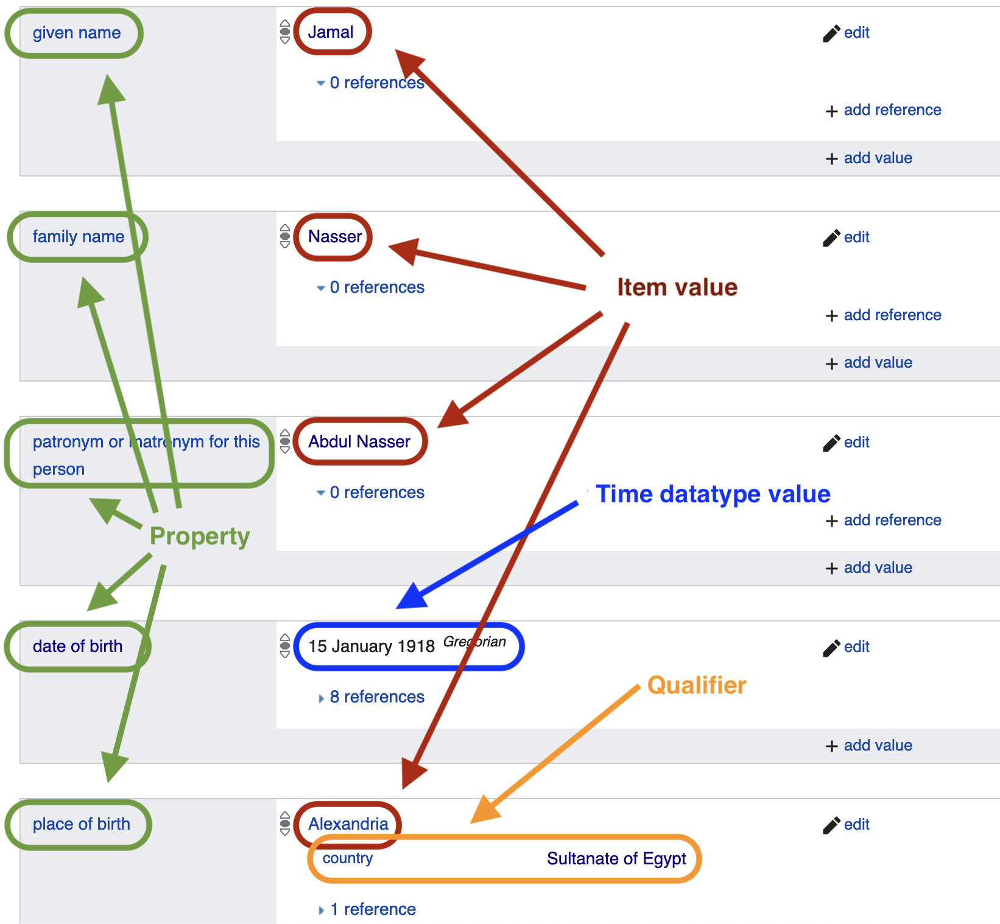



# Lesson Overview

In this lesson you will learn:
- what kinds of information Wikidata contains, 
- how to explore that data in order to contextualize questions in your historical research, and
- how to edit and add data in Wikidata.

While this stand-alone lesson focuses on Wikidata, it can also serve to extend your understanding of Linked Open Data. Wikidata is the most user-friendly implementation of this data structure, and it's under constant development. It's a great place to learn about key graph data features, such as schemas and the SPARQL query language, which can be applied in other contexts. After completing this lesson, users might wish to read Jonathan Blaney's [Introduction to the Principles of Linked Open Data](https://programminghistorian.org/en/lessons/intro-to-linked-data), which covers some of the same ground in more abstract and general terms. (When Blaney wrote his lesson, Wikidata did not yet exist.) 

There are no prerequisites for this lesson, but most users will want to log in to Wikidata in order to personalize language settings. A Wikipedia user id also works in Wikidata.

# What is Wikidata?
The cluster of technologies called [semantic web](https://en.wikipedia.org/wiki/Semantic_Web)/[graph data](https://en.wikipedia.org/wiki/Graph_database)/[linked data](https://en.wikipedia.org/wiki/Linked_data#Linked_open_data)/[resource description framework](https://en.wikipedia.org/wiki/Resource_Description_Framework) has been an object of fascination for years, due to its potential to solve the problem of aggregating extemely diverse data sets. Outside of some specialist cases, that potential had not been realized until the late 2010s, with the advent and popularization of Wikidata. Now, for the first time, historians interested in these technologies have a substantial, well-supported foundation for their work.[^2] 

[Wikidata](https://www.wikidata.org/wiki/Wikidata:Introduction) is the world's largest open data set--or, to use its self-identification, "knowledge base." Like any database, it operates according to rigid rules about how information must be structured. Unlike most databases, Wikidata's structure prioritizes open contribution and collaboration protocols, interoperability, and linking between data sets. For historians, this data structure offers something especially attractive: in cases of uncertainty, it can accommodate more than one answer.

Wikidata is a sibling of Wikipedia, and shares its [politics of knowledge production and dissemination](https://en.wikipedia.org/wiki/Wikipedia:Five_pillars), as well as the [values of the Wikimedia Foundation](https://wikimediafoundation.org/about/values/#a1-we-are-in-this-mission-together). The debate over Wikipedia's merits and faults is rich; many historians will agree that it's a convenient place to look up facts, refreshingly broad and democratic in its coverage, but it can be unreliable in its synthesis.[^1] Wikidata's content, in contrast to Wikipedia, all facts and no synthesis. 

## An example of an item page
To get an idea of Wikidata's nature, and without worrying too much about the format, spend a bit of time scrolling through what Wikidata has to tell us about former Egyptian president [Gamal Abdel Nasser](https://www.wikidata.org/wiki/Q39524). 

At the top of this page, you will see many variant versions and spellings of his name, in various languages. The main spelling is called a "label," and each variant is an "alias."

Wikidata's multilingual functionality is superb. Click on "all entered languages" to see just how true this is. If you wish to interface with the whole knowledge base in a language other than English, log in and click "English" at the top. You may now choose another language (and you can [do more with language on Wikidata](https://www.wikidata.org/wiki/Help:Navigating_Wikidata/User_Options#Language_settings)). 


A bit further down, a section of **Statements** begins. Some of these statements are the sort of transparent information you'd see on a passport: "sex or gender" is "male", "date of birth." Others (such as "instance of" "human") may be a bit less obvious–we'll say more about those later.

Even further down, you'll find another section with the heading **Identifiers**. Here you'll find unique identifiers from dozens of other databases–from the Library of Congress to the Internet Movie Database–that identify Abdel Nasser in their systems. This avalanche of identifiers is characteristic of the linked data universe. (For further background on this point, read the [section on linked data authorities](https://programminghistorian.org/en/lessons/intro-to-linked-data#linked-open-data-what-is-it) in Blaney's lesson.) And at the very bottom, you will see a list of all of the Wikipedia pages about him. 

## Explaining the page
**Unique identifiers** are one key to understanding Wikidata. Wikidata's own identifier for Abdel Nasser can be found in the URL of his page, which is `https://www.wikidata.org/wiki/Q39524.` Abdel Nasser and all of the other objects that Wikidata describes are called **items**. The Q-number, which is the unique identifier that you find at the end of the URL at the top of every item's page (`Q39524` for Abdel Nasser), is the essence of any item. Everything else you see on the page is semantics: optional labels and signfiers and statements about this identifier.

Most historians--particularly those with some background in postcolonial theory--might readily identify the value in distinguishing between the signifier and the signified. In the Wikidata knowledge base, the signfied are only ever numbers; everything else is a signifier. This distinction means that the relationships between items do not depend on arbitrary human semantic choices. Wikidata can use multiple terms for the same idea, and those terms can change, without breaking the database.

Wikidata also uses P-numbers, which refer to **properties**. In the "Statements" section, you will note two columns. The first column (with a grey field) contains properties. The second column (with a white field) contains values that answer these properties (sometimes these are called "objects" of properties). These values may be items, or dates, or strings, or other datatypes. This lesson is not the place to get bogged down in the [complexities of data models](https://www.wikidata.org/wiki/Wikidata:Data_model). Instead, as you begin to explore Wikidata, employ a common sense reading of those properties that make sense to you.



You can click on any item or property to go to its own page, which will give you a description, aliases, statements, and identifers related to that idea. And it is useful to know that every Wikipedia page has a counterpart item in Wikidata, accessible via a link the left hand tools menu:


To get more of a taste for Wikidata, find the Wikidata item associated with Wikipedia page on a subject of interest to you. Click on links on that page–some will make sense, probably; others will not. Focus on those that are most transparent, and orient yourself a bit in the web of data that makes up Wikidata.

You are probably thinking that on the face of things, there's nothing especially enticing about these lists of details. This is correct: you could simply look up most of this trivia in any decent reference book. But Wikidata's value does not consist in its isolated factoids. Instead, Wikidata's power derives from the way that it combines these data points with all of the other data it contains. It does this with a powerful seach protocol called [SPARQL](https://en.wikipedia.org/wiki/SPARQL). 

## Combining factoids
We'll learn more about SPARQL itself later, but let's start by exploring a trivial example of combined details. Let's say your whimsy leads you to wonder about the age at which mid-twentieth-century leaders took power. Here's [a query that returns that information](https://query.wikidata.org/#%23%20Age%20of%20heads%20of%20state%20upon%20taking%20power%2C%201950-1980%0ASELECT%20DISTINCT%20%3FheadOfState%20%3FheadOfStateLabel%20%28MIN%28%3Fage%29%20as%20%3FageMin%29%20%3FcountryLabel%20%3FpositionLabel%0A%7B%0A%20%23%20find%20heads%20of%20state%20positions%0A%20hint%3AQuery%20hint%3Aoptimizer%20%22None%22.%0A%20%3Fposition%20wdt%3AP279%2a%20wd%3AQ48352%20.%0A%0A%20%23%20sovereign%20states%20only%0A%20%3Fposition%20wdt%3AP1001%20%3Fcountry%20.%0A%20%3Fcountry%20wdt%3AP31%20wd%3AQ3624078%20.%0A%20%20%0A%20%23%20fetch%20names%20of%20officeholders%0A%20%3FheadOfState%20wdt%3AP39%20%3Fposition%20.%0A%0A%20%23%20birthdates%20of%20officeholders%0A%20%3FheadOfState%20wdt%3AP569%20%3Fdob.%20hint%3APrior%20hint%3ArangeSafe%20true.%20%0A%20%20%0A%20%23%20date%20of%20term%20start%0A%20%3FheadOfState%20p%3AP39%20%3Fstatement%20.%0A%20%3Fstatement%20ps%3AP39%20%3Fposition%20.%20%0A%20%3Fstatement%20pq%3AP580%20%3FtermStart.%20hint%3APrior%20hint%3ArangeSafe%20true.%0A%20%20%0A%20%23%201950-1980%20term%20start%20only%0A%20FILTER%28%221950-01-01%22%5E%5Exsd%3AdateTime%20%3C%3D%20%3FtermStart%20%26%26%20%3FtermStart%20%3C%20%221980-01-01%22%5E%5Exsd%3AdateTime%29%0A%20%0A%20%23%20calcuate%20age%20%0A%20BIND%28YEAR%28%3FtermStart%29-YEAR%28%3Fdob%29%20as%20%3Fage%29%0A%20SERVICE%20wikibase%3Alabel%20%7B%20bd%3AserviceParam%20wikibase%3Alanguage%20%22en%22%20%7D%0A%7D%0AGROUP%20BY%20%3FheadOfState%20%3FheadOfStateLabel%20%3FcountryLabel%20%3FpositionLabel%0AORDER%20BY%20DESC%28%3FageMin%29) via the Wikidata query service. To execute the query, press the blue "play" button at the bottom left.

Scrolling down the table of results, which are sorted by age, you will find that Abdel Nasser became president when he was 38 (in 1954). Comparing him to the hundreds of other heads of state listed, we can see that some first took power at an older age, and some at a younger age. If you happen to be interested in leaders, life cycle, and generations, this list is a good starting point for further data exploration and hypothesis testing.

Wikidata supports data-informed contextualization of this kind. It's easy, with an additional query statement, to enrich your data: [add a continent column](https://query.wikidata.org/#%23%20Age%20of%20heads%20of%20state%20upon%20taking%20power%2C%201950-1980%2C%20with%20continent%20listed%0ASELECT%20DISTINCT%20%3FheadOfState%20%3FheadOfStateLabel%20%28MIN%28%3Fage%29%20as%20%3FageMin%29%20%3FcountryLabel%20%3FpositionLabel%20%3FcontinentLabel%0A%7B%0A%20%23%20find%20heads%20of%20state%20positions%0A%20hint%3AQuery%20hint%3Aoptimizer%20%22None%22.%0A%20%3Fposition%20wdt%3AP279%2a%20wd%3AQ48352%20.%0A%0A%20%23%20sovereign%20states%20only%0A%20%3Fposition%20wdt%3AP1001%20%3Fcountry%20.%0A%20%3Fcountry%20wdt%3AP31%20wd%3AQ3624078%20.%0A%20%3Fcountry%20wdt%3AP30%20%3Fcontinent%20.%0A%20%20%0A%20%23%20fetch%20names%20of%20officeholders%0A%20%3FheadOfState%20wdt%3AP39%20%3Fposition%20.%0A%0A%20%23%20birthdates%20of%20officeholders%0A%20%3FheadOfState%20wdt%3AP569%20%3Fdob.%20hint%3APrior%20hint%3ArangeSafe%20true.%20%0A%20%20%0A%20%23%20date%20of%20term%20start%0A%20%3FheadOfState%20p%3AP39%20%3Fstatement%20.%0A%20%3Fstatement%20ps%3AP39%20%3Fposition%20.%20%0A%20%3Fstatement%20pq%3AP580%20%3FtermStart.%20hint%3APrior%20hint%3ArangeSafe%20true.%0A%20%20%0A%20%23%201950-1980%20term%20start%20only%0A%20FILTER%28%221950-01-01%22%5E%5Exsd%3AdateTime%20%3C%3D%20%3FtermStart%20%26%26%20%3FtermStart%20%3C%20%221980-01-01%22%5E%5Exsd%3AdateTime%29%0A%20%0A%20%23%20calcuate%20age%20%0A%20BIND%28YEAR%28%3FtermStart%29-YEAR%28%3Fdob%29%20as%20%3Fage%29%0A%20SERVICE%20wikibase%3Alabel%20%7B%20bd%3AserviceParam%20wikibase%3Alanguage%20%22en%22%20%7D%0A%7D%0AGROUP%20BY%20%3FheadOfState%20%3FheadOfStateLabel%20%3FcountryLabel%20%3FpositionLabel%20%3FcontinentLabel%0AORDER%20BY%20DESC%28%3FageMin%29), [add a gender column and count of spouses and children](https://query.wikidata.org/#%23%20Age%20of%20heads%20of%20state%20upon%20taking%20power%2C%201950-1980%2C%20with%20gender%2C%20spouse%20and%20child%20count%0ASELECT%20DISTINCT%20%3FheadOfState%20%3FheadOfStateLabel%20%28MIN%28%3Fage%29%20as%20%3FageMin%29%20%3FcountryLabel%20%3FpositionLabel%20%20%3FgenderLabel%20%28COUNT%28DISTINCT%20%3Fspouse%29%20as%20%3Fspouses%29%20%28COUNT%28DISTINCT%20%3Fchild%29%20as%20%3Fchildren%29%0A%7B%0A%20%23%20find%20heads%20of%20state%20positions%0A%20hint%3AQuery%20hint%3Aoptimizer%20%22None%22.%0A%20%3Fposition%20wdt%3AP279%2a%20wd%3AQ48352%20.%0A%0A%20%23%20sovereign%20states%20only%0A%20%3Fposition%20wdt%3AP1001%20%3Fcountry%20.%0A%20%3Fcountry%20wdt%3AP31%20wd%3AQ3624078%20.%0A%20%20%0A%20%23%20fetch%20names%20of%20officeholders%0A%20%3FheadOfState%20wdt%3AP39%20%3Fposition%20.%0A%20%20%0A%20%20%23%20fetch%20gender%0A%20%20%3FheadOfState%20wdt%3AP21%20%3Fgender%20.%0A%20%20%0A%20%20%23%20fetch%20spouses%20and%20children%0A%20%20OPTIONAL%7B%3FheadOfState%20wdt%3AP26%20%3Fspouse%20.%7D%0A%20%20OPTIONAL%7B%3FheadOfState%20wdt%3AP40%20%3Fchild%20.%7D%0A%0A%20%23%20birthdates%20of%20officeholders%0A%20%3FheadOfState%20wdt%3AP569%20%3Fdob.%20hint%3APrior%20hint%3ArangeSafe%20true.%20%0A%20%20%0A%20%23%20date%20of%20term%20start%0A%20%3FheadOfState%20p%3AP39%20%3Fstatement%20.%0A%20%3Fstatement%20ps%3AP39%20%3Fposition%20.%20%0A%20%3Fstatement%20pq%3AP580%20%3FtermStart.%20hint%3APrior%20hint%3ArangeSafe%20true.%0A%20%20%0A%20%23%201950-1980%20term%20start%20only%0A%20FILTER%28%221950-01-01%22%5E%5Exsd%3AdateTime%20%3C%3D%20%3FtermStart%20%26%26%20%3FtermStart%20%3C%20%221980-01-01%22%5E%5Exsd%3AdateTime%29%0A%20%0A%20%23%20calcuate%20age%20%0A%20BIND%28YEAR%28%3FtermStart%29-YEAR%28%3Fdob%29%20as%20%3Fage%29%0A%20SERVICE%20wikibase%3Alabel%20%7B%20bd%3AserviceParam%20wikibase%3Alanguage%20%22en%22%20%7D%0A%7D%0AGROUP%20BY%20%3FheadOfState%20%3FheadOfStateLabel%20%3FcountryLabel%20%3FpositionLabel%20%3FgenderLabel%0AORDER%20BY%20DESC%28%3FageMin%29), or [add a column giving each leader's name in her or his native language](https://query.wikidata.org/#%23%20Age%20of%20heads%20of%20state%20upon%20taking%20power%2C%201950-1980%2C%20with%20name%20in%20native%20language%0ASELECT%20DISTINCT%20%3FheadOfState%20%3FheadOfStateLabel%20%20%3FnameInNativeLanguage%20%28MIN%28%3Fage%29%20as%20%3FageMin%29%20%3FcountryLabel%20%3FpositionLabel%0A%7B%0A%20%23%20find%20heads%20of%20state%20positions%0A%20hint%3AQuery%20hint%3Aoptimizer%20%22None%22.%0A%20%3Fposition%20wdt%3AP279%2a%20wd%3AQ48352%20.%0A%0A%20%23%20sovereign%20states%20only%0A%20%3Fposition%20wdt%3AP1001%20%3Fcountry%20.%0A%20%3Fcountry%20wdt%3AP31%20wd%3AQ3624078%20.%0A%20%20%0A%20%23%20fetch%20names%20of%20officeholders%0A%20%3FheadOfState%20wdt%3AP39%20%3Fposition%20.%0A%20%0A%20%20%23%20fetch%20name%20in%20native%20language%0A%20OPTIONAL%20%7B%3FheadOfState%20wdt%3AP1559%20%3FnameInNativeLanguage%20.%7D%0A%20%0A%20%23%20birthdates%20of%20officeholders%0A%20%3FheadOfState%20wdt%3AP569%20%3Fdob.%20hint%3APrior%20hint%3ArangeSafe%20true.%20%0A%20%20%0A%20%23%20date%20of%20term%20start%0A%20%3FheadOfState%20p%3AP39%20%3Fstatement%20.%0A%20%3Fstatement%20ps%3AP39%20%3Fposition%20.%20%0A%20%3Fstatement%20pq%3AP580%20%3FtermStart.%20hint%3APrior%20hint%3ArangeSafe%20true.%0A%20%20%0A%20%23%201950-1980%20term%20start%20only%0A%20FILTER%28%221950-01-01%22%5E%5Exsd%3AdateTime%20%3C%3D%20%3FtermStart%20%26%26%20%3FtermStart%20%3C%20%221980-01-01%22%5E%5Exsd%3AdateTime%29%0A%20%0A%20%23%20calcuate%20age%20%0A%20BIND%28YEAR%28%3FtermStart%29-YEAR%28%3Fdob%29%20as%20%3Fage%29%0A%20SERVICE%20wikibase%3Alabel%20%7B%20bd%3AserviceParam%20wikibase%3Alanguage%20%22en%22%20%7D%0A%7D%0AGROUP%20BY%20%3FheadOfState%20%3FheadOfStateLabel%20%3FcountryLabel%20%3FpositionLabel%20%3FnameInNativeLanguage%0AORDER%20BY%20DESC%28%3FageMin%29).

All such results can be downloaded in the usual data formats and as code snippets in various programming languages. Wikidata even includes a rudimentary visualization package with its query service, which can help in quick data exploration. Here's a [map of the birthplace of everyone with the first name "Gamal."](https://query.wikidata.org/#%23Birthplaces%20of%20people%20with%20given%20name%20Jamal%0A%23defaultView%3AMap%0ASELECT%20%3Fjamal%20%3FjamalLabel%20%3FbirthplaceLabel%20%3Fcoords%20%0AWHERE%0A%7B%0A%20%20%3Fjamal%20wdt%3AP735%20wd%3AQ1261968.%20%0A%20%20%3Fjamal%20wdt%3AP19%20%3Fbirthplace.%0A%20%20%3Fbirthplace%20wdt%3AP625%20%3Fcoords.%0A%20%20SERVICE%20wikibase%3Alabel%20%7B%20bd%3AserviceParam%20wikibase%3Alanguage%20%22%5BAUTO_LANGUAGE%5D%2Cen%22.%20%7D%0A%7D)

Obviously, this is only a tiny fraction of the world's Jamals. It is essential to recognize what Wikidata does not do–and should not be expected to do. The knowledge base is vast, but it will always be incomplete. While many or even most of the data in these lists of results are more or less correct, we find some individual answers that don't make sense, and others that are missing.

This incompleteness is a function of two features of the knowledge base. First, there is no guarantee that the data it contains are accurate, and no rigid requirement that it be source referenced. At the time of writing, eight references attested Abdel Nasser's date of birth:


However, we only have one reference for the date when he assumed the Prime Minister's office. That reference is to the [list of Egyptian Prime Ministers in English Wikipedia](https://en.wikipedia.org/wiki/List_of_prime_ministers_of_Egypt)–which could itself be scrutinized for accuracy and conpleteness. Generally speaking, at this point in its development, Wikidata's references are relatively poor in quality and quantity. However, in many cases, we can reasonably assume that factual information in Wikidata will typically be accurate for purposes of data exploration and hypothesis testing. Our historian's judgment will serve us well when we look at the evidence more closely.

A second (and more interesting) reason for incomplete query results concerns the structure of knowledge that Wikidata produces. Briefly put, Wikidata must be queried using its own (often idiosyncratic) terms and categories. You must understand its taxonomies in order to use it effectively, and this issue warrants a section of its own. 

## Key vocabulary:
- item
- property
- label
- alias
- identifier
- statement

# Wikidata's taxonomies
Categories and semantics are a juicy problem for any historian. This is true in analog scholarly debate, and it is also true when we consider Wikidata and other semantic data structures.

While there is (probably) general consensus on the meaning of "date of birth," most concepts are not so clear cut. Take, for example, "head of state"([Q48352](https://www.wikidata.org/wiki/Q48352)), used in the age query above to identify Abdel Nasser and his counterparts in other countries. But perhaps we should have used the Wikidata item labeled "head of government"([Q2285706](https://www.wikidata.org/wiki/Q2285706)) instead? Let's take a closer look at "head of state" and "head of government."

It is the time to introduce a concept that may be new to most historians: **class**. Not the class of "class struggle," silly! In database ontology, [class](https://en.wikipedia.org/wiki/Class_(knowledge_representation)) is a logical term organizing concepts in a data structure. Looking again at the item page, we see that "head of state"([Q48352](https://www.wikidata.org/wiki/Q48352)) is an "instance of"([P31](https://www.wikidata.org/wiki/Property:P31)) (or kind or example of) "public office"([Q294414](https://www.wikidata.org/wiki/Q294414)), but a "subclass of"([P279](https://www.wikidata.org/wiki/Property:P279)) "statesperson"([Q372436](https://www.wikidata.org/wiki/Q372436)) and "leader"([Q1251441](https://www.wikidata.org/wiki/Q1251441)), This latter statement means that all heads of state are statespersons and leaders, but not all statesperson and leaders are heads of state.

Keen-eyed observers will already detect the presence of a formal taxonomy here. Sure enough, we can look down a step to see all of the public offices that are [subclasses of "head of state"](https://query.wikidata.org/#%23Subclass%20of%20head%20of%20state%0ASELECT%20%3FheadOfStateSubclass%20%3FheadOfStateSubclassLabel%20%28COUNT%28%3Fitem%29%20as%20%3Fcount%29%0AWHERE%0A%7B%0A%20%20%3FheadOfStateSubclass%20wdt%3AP279%2a%20wd%3AQ48352.%0A%20%20%3Fitem%20wdt%3AP31%7Cwdt%3AP39%7Cwdt%3AP106%20%3FheadOfStateSubclass.%0A%20%20SERVICE%20wikibase%3Alabel%20%7B%20bd%3AserviceParam%20wikibase%3Alanguage%20%22%5BAUTO_LANGUAGE%5D%2Cen%22.%20%7D%20%0A%7D%0AGROUP%20BY%20%3FheadOfStateSubclass%20%3FheadOfStateSubclassLabel%20%0AORDER%20BY%20DESC%28%3Fcount%29) (ordered by number of instances). You will notice that "head of state" gives us a lot of monarchs and US state governors, among thousands of other positions. In contrast, consider the list of the [subclasses of "head of government"](https://query.wikidata.org/#%23Subclass%20of%20head%20of%20government%0ASELECT%20%3FheadOfGovtSubclass%20%3FheadOfGovtSubclassLabel%20%28COUNT%28%3Fitem%29%20as%20%3Fcount%29%0AWHERE%0A%7B%0A%20%20%3FheadOfGovtSubclass%20wdt%3AP279%2a%20wd%3AQ2285706.%0A%20%20%3Fitem%20wdt%3AP31%7Cwdt%3AP39%7Cwdt%3AP106%20%3FheadOfGovtSubclass.%0A%20%20SERVICE%20wikibase%3Alabel%20%7B%20bd%3AserviceParam%20wikibase%3Alanguage%20%22%5BAUTO_LANGUAGE%5D%2Cen%22.%20%7D%20%0A%7D%0AGROUP%20BY%20%3FheadOfGovtSubclass%20%3FheadOfGovtSubclassLabel%20%0AORDER%20BY%20DESC%28%3Fcount%29). "Head of government" is dominated by mayors and prime ministers. ("Captain Regent of San Marino" features high on both lists--probably as the result of a zealous contributor making sure these entries were complete.) 

<div class="table-wrapper" markdown="block">

| Head of state subclass | count | Head of government subclass | count |
| --------- | --------- | --------- | --------- |
|president ([Q30461](https://www.wikidata.org/wiki/Q30461))|6314|mayor ([Q30185](https://www.wikidata.org/wiki/Q30185))|21578|
|regent ([Q477406](https://www.wikidata.org/wiki/Q477406))|911|mayor of a place in the Netherlands ([Q13423499](https://www.wikidata.org/wiki/Q13423499))|3750|
|Captain Regent of San Marino ([Q258045](https://www.wikidata.org/wiki/Q258045))|893|mayor of a place in France ([Q382617](https://www.wikidata.org/wiki/Q382617))|1794|
|pope ([Q19546](https://www.wikidata.org/wiki/Q19546))|267|Captain Regent of San Marino ([Q258045](https://www.wikidata.org/wiki/Q258045))|893|
|Doge of Genoa ([Q3712541](https://www.wikidata.org/wiki/Q3712541))|172|mayor of a place in the Czech Republic ([Q99356295](https://www.wikidata.org/wiki/Q99356295))|892|
|Ban of Croatia ([Q253779](https://www.wikidata.org/wiki/Q253779))|141|mayor of a place in Hungary ([Q2922332](https://www.wikidata.org/wiki/Q2922332))|768|
|President of the Generalitat of Catalonia ([Q16933549](https://www.wikidata.org/wiki/Q16933549))|133|mayor of a place in Italy ([Q670106](https://www.wikidata.org/wiki/Q670106))|657|
|Doge of Venice ([Q858316](https://www.wikidata.org/wiki/Q858316))|126|mayor in Luxembourg ([Q29639349](https://www.wikidata.org/wiki/Q29639349))|446|
|Emperor of Japan ([Q208233](https://www.wikidata.org/wiki/Q208233))|124|lord mayor ([Q109862464](https://www.wikidata.org/wiki/Q109862464))|446|
|Hetman of Zaporizhian Host ([Q16157109](https://www.wikidata.org/wiki/Q16157109))|110|Lord Mayor of London ([Q73341](https://www.wikidata.org/wiki/Q73341))|439|
</div>
Table 1: Top 10 subclasses of two similar classes (summer 2024)

Confronted with this mass of examples, you might feel somewhat confused, both by particular instances and by the overall picture. This empirically-generated account is a long way from the synthetic statements of Wikipedia. Such ambiguous bodies of results embody the virtue and value of Wikidata for historians. It is not an automatic answer box. It is an elaborate logical structure giving precise answers to abstract questions about which there is no real consensus. Any serious user learn which taxonomies Wikidata already uses to describe their topics of interest. Users must also use their knowledge of context to mediate between the theoretical and the empirical. Fortunately, this is exactly what historians are trained to do.

Let's run the age-of-first-taking-office query we used in the Abdel Nasser example above, [but use "head of government" instead of "head of state"](https://query.wikidata.org/#%23%20Age%20of%20heads%20of%20government%20upon%20taking%20power%2C%201950-1980%0ASELECT%20DISTINCT%20%3FheadOfGovt%20%3FheadOfGovtLabel%20%28MIN%28%3Fage%29%20as%20%3FageMin%29%20%3FcountryLabel%20%3FpositionLabel%0A%7B%0A%20%23%20find%20heads%20of%20state%20positions%0A%20hint%3AQuery%20hint%3Aoptimizer%20%22None%22.%0A%20%3Fposition%20wdt%3AP279%2a%20wd%3AQ2285706%20.%0A%0A%20%23%20sovereign%20states%20only%0A%20%3Fposition%20wdt%3AP1001%20%3Fcountry%20.%0A%20%3Fcountry%20wdt%3AP31%20wd%3AQ3624078%20.%0A%20%20%0A%20%23%20fetch%20names%20of%20officeholders%0A%20%3FheadOfGovt%20wdt%3AP39%20%3Fposition%20.%0A%0A%20%23%20birthdates%20of%20officeholders%0A%20%3FheadOfGovt%20wdt%3AP569%20%3Fdob.%20hint%3APrior%20hint%3ArangeSafe%20true.%20%0A%20%20%0A%20%23%20date%20of%20term%20start%0A%20%3FheadOfGovt%20p%3AP39%20%3Fstatement%20.%0A%20%3Fstatement%20ps%3AP39%20%3Fposition%20.%20%0A%20%3Fstatement%20pq%3AP580%20%3FtermStart.%20hint%3APrior%20hint%3ArangeSafe%20true.%0A%20%20%0A%20%23%201950-1980%20term%20start%20only%0A%20FILTER%28%221950-01-01%22%5E%5Exsd%3AdateTime%20%3C%3D%20%3FtermStart%20%26%26%20%3FtermStart%20%3C%20%221980-01-01%22%5E%5Exsd%3AdateTime%29%0A%20%0A%20%23%20calcuate%20age%20%0A%20BIND%28YEAR%28%3FtermStart%29-YEAR%28%3Fdob%29%20as%20%3Fage%29%0A%20SERVICE%20wikibase%3Alabel%20%7B%20bd%3AserviceParam%20wikibase%3Alanguage%20%22en%22%20%7D%0A%7D%0AGROUP%20BY%20%3FheadOfGovt%20%3FheadOfGovtLabel%20%3FcountryLabel%20%3FpositionLabel%0AORDER%20BY%20DESC%28%3FageMin%29). This query returns Abdel Nasser's age when he became prime minister rather than president. But this query accurately captures other leaders who are not returned with the "head of state" query. For instance, it returns prime ministers in states where the president is largely ceremonial. But it also includes some mayors. And there are other oddities--for example, at the time of writing (summer 2024), no leader of India appears in either list.[^3] In sum, different forms of a similar question yield valid but different, incomplete, and imperfect answers. 

Historians tend to be sceptical of taxonomic schemes, with good reason. But explicit taxonomies can do great work for us as a means to discover and explore information. No doubt you will find (what you consider to be) errors in this taxonomy. You can certainly "correct" those errors–Wikidata is open–but don't be too hasty. The taxonomies already existing in Wikidata are organic and collectively produced, and they are not exclusive. There are ways to work around the parts you don't agree with. Don't change the knowledge base itself until you have learned how to do this.

A big part of our expertise as historians is contextualizing details. For many of us, that's the fun and fascinating work. And that skill is precisely what a researcher needs to interact with the galaxy of isolated factoids in Wikidata. The rest of this lesson shows a few of the main ways to do that.

## Vocabulary
- class
- subclass

# Querying Wikidata

As we've already seen, Wikidata cannot be expected to provide definitive or comprehensive answers to any and all questions. It does better with some kinds of questions than others, and historians ought to approach the knowledge base with a spirit of exploration and experimentation. There are no bad questions in Wikidata–only unrealistic questions.

As in most historical domains, the data trail of dead white men is relatively overrepresented. Want a list of colleges attended by governors of American states? [This query](https://query.wikidata.org/#%23%20colleges%20attended%20by%20governors%20of%20US%20states%0ASELECT%20%3FcollegeLabel%20%28COUNT%28%3FcollegeLabel%29%20AS%20%3Fcount%29%20%0AWHERE%0A%7B%20%23%20define%20office%20of%20US%20governor%0A%20%20%3Foffice%20wdt%3AP279%2a%20wd%3AQ889821.%0A%20%20%0A%20%20%23%20find%20officeholders%0A%20%20%3Fgovernor%20wdt%3AP39%20%3Foffice.%0A%20%20%0A%20%20%23%20find%20college%0A%20%20%3Fgovernor%20wdt%3AP69%20%3Fcollege.%0A%20%20SERVICE%20wikibase%3Alabel%20%7B%20bd%3AserviceParam%20wikibase%3Alanguage%20%22%5BAUTO_LANGUAGE%5D%2Cen%22.%20%7D%0A%7D%0AGROUP%20BY%20%3FcollegeLabel%20%0AORDER%20BY%20DESC%28%3Fcount%29) is probably about right (don't forget to press play). Want a list of colleges attended by governors of Chinese provinces? [This query](https://query.wikidata.org/#%23%20colleges%20attended%20by%20governors%20of%20Chinese%20provinces%0ASELECT%20%3FcollegeLabel%20%28COUNT%28%3FcollegeLabel%29%20AS%20%3Fcount%29%20%0AWHERE%0A%7B%20%23%20define%20office%20of%20governor%20of%20Chinese%20provinces%0A%20%20%3Foffice%20wdt%3AP279%2a%20wd%3AQ1540323.%0A%20%20%0A%20%20%23%20find%20officeholders%0A%20%20%3Fgovernor%20wdt%3AP39%20%3Foffice.%0A%20%20%0A%20%20%23%20find%20college%0A%20%20%3Fgovernor%20wdt%3AP69%20%3Fcollege.%0A%20%20SERVICE%20wikibase%3Alabel%20%7B%20bd%3AserviceParam%20wikibase%3Alanguage%20%22%5BAUTO_LANGUAGE%5D%2Cen%22.%20%7D%0A%7D%0AGROUP%20BY%20%3FcollegeLabel%20%0AORDER%20BY%20DESC%28%3Fcount%29) yields less-than-convincing results.

Generally speaking, questions about specifics, like dates and locations and labels, yield the best answers from Wikidata. For example, here's a [map of the birthplaces of governors of American states, color coded by half-century of birth](https://query.wikidata.org/#%23%20map%20birthplaces%20of%20governors%20of%20US%20states%2C%20grouped%20by%20half-century%0A%23defaultView%3AMap%0ASELECT%20%3FgovernorLabel%20%3FbirthplaceLabel%20%3Fcoord%20%3Fdob%20%3Fbirthyear%20%3Flayer%0AWHERE%0A%7B%20%23%20define%20office%20of%20US%20governor%0A%20%20%3Foffice%20wdt%3AP279%2a%20wd%3AQ889821.%0A%20%20%0A%20%20%23%20find%20officeholders%0A%20%20%3Fgovernor%20wdt%3AP39%20%3Foffice.%0A%20%20%0A%20%20%23%20find%20birthplace%20and%20birthdate%0A%20%20%3Fgovernor%20wdt%3AP19%20%3Fbirthplace%3B%0A%20%20%20%20%20%20%20%20%20%20%20%20wdt%3AP569%20%3Fdob.%0A%20%20%0A%20%20%23%20geocoordinates%20of%20birthplace%0A%20%20%3Fbirthplace%20wdt%3AP625%20%3Fcoord.%0A%20%20%0A%20%20%23%20group%20birth%20years%0A%20%20BIND%28YEAR%28%3Fdob%29%20as%20%3Fbirthyear%29%0A%20%20BIND%28IF%28%20%28%3Fbirthyear%20%3C%201700%29%2C%20%22Pre-1700%22%2C%20IF%28%28%3Fbirthyear%20%3C%201751%29%2C%20%221700-1750%22%2C%20IF%28%28%3Fbirthyear%20%3C%201801%29%2C%20%221751-1800%22%2C%20IF%28%28%3Fbirthyear%20%3C%201851%29%2C%20%221801-1850%22%2C%20IF%28%28%3Fbirthyear%20%3C%201901%29%2C%20%221851-1900%22%2C%20IF%28%28%3Fbirthyear%20%3C%201951%29%2C%20%221901-1950%22%2C%20%22Post-1950%22%29%20%29%20%29%20%29%20%29%29%20AS%20%3Flayer%20%29%0A%20%20%0A%20%20SERVICE%20wikibase%3Alabel%20%7B%20bd%3AserviceParam%20wikibase%3Alanguage%20%22%5BAUTO_LANGUAGE%5D%2Cen%22.%20%7D%0A%7D%0A). And here's a [list of the names of governors of American states in Russian and Hebrew transliteration](https://query.wikidata.org/#%23%20names%20of%20governors%20of%20US%20states%20in%20Russian%20and%20Hebrew%20transliterations%0ASELECT%20%3Fgovernor%20%3FgovernorLabel%20%3FgovernorLabel_ru%20%3FgovernorLabel_he%0AWHERE%0A%7B%20%23%20define%20office%20of%20US%20governor%0A%20%20%3Foffice%20wdt%3AP279%2a%20wd%3AQ889821.%0A%20%20%0A%20%20%23%20find%20officeholders%0A%20%20%3Fgovernor%20wdt%3AP39%20%3Foffice.%0A%20%20%20%0A%20%20%23%20Russian%20transliteration%0A%20%20OPTIONAL%7B%3Fgovernor%20rdfs%3Alabel%20%3FgovernorLabel_ru%20FILTER%28LANG%28%3FgovernorLabel_ru%29%20%3D%20%22ru%22%29%7D%0A%20%20%0A%20%20%23%20Hebrew%20transliteration%0A%20%20OPTIONAL%7B%3Fgovernor%20rdfs%3Alabel%20%3FgovernorLabel_he%20FILTER%28LANG%28%3FgovernorLabel_he%29%20%3D%20%22he%22%29%7D%0A%20%20%20%20%0A%20%20SERVICE%20wikibase%3Alabel%20%7B%20bd%3AserviceParam%20wikibase%3Alanguage%20%22%5BAUTO_LANGUAGE%5D%2Cen%22.%20%7D%0A%7D%0A). 

Our internet search engine habit of searching via keyword and string, on the other hand, does not play to Wikidata's strengths in aggregate search. Strings work well to find particular items; you can search by label and alias in the simple seach box at the top right of the [Wikidata main page](https://www.wikidata.org/wiki/Wikidata:Main_Page) and every item and property page. (Supplying a comprehensive list of aliases will certainly improve the discoverability and disambiguation of items of interest to you.) But the powerful query service is not designed around string searches.

It takes a while to get the hang of the [Wikidata query service](https://query.wikidata.org/). But playing around with it is one of the easiest paths to learn about Wikidata–and about linked data in general. The best way to query this service is using the SPARQL query language, which is [introduced in another (currently retired) Programming Historian lesson](https://programminghistorian.org/en/lessons/retired/graph-databases-and-SPARQL). SPARQL is incredibly powerful, but it takes some learning. Wikidata's own [SPARQL tutorial](https://www.wikidata.org/wiki/Wikidata:SPARQL_tutorial) is very good, but the following query shortcuts built into Wikidata offer an even more friendly introductory path for new users. 

### Query shortcut I: Wikidata Query Builder 
Before you even dig into SPARQL, you should know that Wikidata offers a [graphic query builder interface](https://query.wikidata.org/querybuilder/). This can't do all of things that SPARQL can do, but it can set up a basic structure for your queries. 

Let's try it out, using a variant of the US governor college query we tried earlier. (Don't forget that you can switch the interface to your prefered language, using the language selector button at the top right.)

The Query Builder form presents you with two blank fields. It requires you to enter one property and one value in order to perform a query. At this point, you are probably still a bit unclear on what "property" and "value" mean in the context of Wikidata. This is a good chance to learn more through practice.

The people we're trying to find are US governors. How should we describe them here? Put your cursor in the "property" field, and try typing some terms. "Governor" doesn't work, and "United States" gives some odd stuff.

What's going on? What is a property? The definition in the infobox is (to my mind) not much help:

> The *property* field in a condition, is the category or descriptor for the *value*. For example, "color" would be a *property* you'd likely use for the *value* "blue".

Maybe this makes sense to you. To me, what makes sense is to think of the property as the verb that connects subject to object in a three-part subject-verb-object statement. In this case, the statement is "Some person (subject) holds the position of (verb) US governor (object)." Type "position held" into the property box, and "governor" in the value box. You'll see that there are different kinds of governors--see if you can find the one that applies to the US. Click "Run Query," and you should see a list of US governors.

But we are trying to find out something different: which colleges these governors attended. So, let's click the "Add Condition" button on the query form. This opens another pair of property/value fields. What property to use? "Educated at" seems about right. What value to use? This step is confusing, because we are trying to find out *where* these governors were educated. We could enter a particular school, which would return a list of all governors educated there. But there is no way, using this form, to produce a list of the schools themselves, or a count of schools of the sort that we saw above. 

If Wikidata had a property named something like "gave an education to," which took schools as its subject and people as its object, we could use this form to find an answer to our question. (We would put "governor" in the value field.) There is no such property in Wikidata however--or it is not widely used. As a consequence, the query builder will not work for us in this case.

***Insight***: Wikidata is a relatively flexible database, but its rules and vocabulary are rigid. In order to use it effectively, you cannot go rogue--you have to rely on the properties and values that previous users have used when building out the data. Sometimes the existing vocabulary will be well-tailored to your purposes. More frequently, you will have to find a workaround. Fortunately, SPARQL is flexible enough to pose almost any question you can imagine. Unfortunately, figuring out how to use SPARQL is a fair bit more involved than the simple Query Builder form.

### Query shortcut II: Example SPARQL queries
Fortunately, Wikidata offers a [long list of example queries](https://www.wikidata.org/wiki/Wikidata:SPARQL_query_service/queries/examples#Most_popular_subjects_of_scientific_articles) that can serve as a guide to SPARQL. All of these queries can be adapted for your own interests, by substituting the item you want for the item the query contains. 

Let's give this a try. Open the [query service](https://query.wikidata.org/), then click on "Examples," then load an example.


#### Example A: Cats
Let's start with the first example query listed: Cats. When you click on the example, the query form loads with the necessary text.


Six colors of text indicate the syntax of the query:
- **blue** for Wikidata items (Q-numbers) and properties (P-numbers). When you float your cursor over a blue-text item or property, a pop-up gives you its label and description. The prefixes (`wdt:`, `wd:` and so on) are significant but beyond the scope of this lesson.
- **green** for the items that you seek (all of which are arbitrary-defined words starting with a ?)
- **grey** for comments (which start with hashtags)
- **red** for functions
- **black** for punctuation
- **orange** for variables

 The cats example is the simplest form of SPARQL query: it returns every `?item` that is an "instance of" (`wdt:P31`) a "cat" (`wd:Q146`). By changing the last Q-number, we can search for all instances of something else. For example, try changing `Q146` to `Q3024240`. Float your cursor over this new item to see what it is, then execute the query and skim the results.

***Insight***: the "instance of" property ([P31](https://www.wikidata.org/wiki/Property:P31)) does a huge amount of work in Wikidata and similar data structures. In simple English, line 5 of the query (`?item wdt:P31 wd:Q146`) could be read as "This item is a cat." You will see P31 everywhere in Wikidata. Just as often, you will see [P279](https://www.wikidata.org/wiki/Property:P279), the "subclass of" property. Try changing line 5 to `?item wdt:P279 wd:Q146`, which could be read as "This item is a *kind of* cat." The query yields different results. What's the takeaway? These two properties are the most common properties in Wikidata and they matter a great deal, but their function won't be immediately apparent.

#### Example B: Humans by death date
Let's try adapting another example query. A bit further down the list of examples of simple queries, just below cats, is "Humans who died on a specific date on the English Wikipedia, ordered by label." Click on this one. It's preloaded with August 25, 2001, but you can change the date (in orange) from `"+2001-08-25"` to any other date. Try your birthdate. In the results, the `?sl` column on the right counts the pages that Wikipedia and its sister projects hold on the individual.

***Insight***: Orange text in the Wikidata query service contains variables, like dates and languages, that you can modify for your own purposes.

#### Example C: Popular names
One more example of adapting an existing query? Load the query "[Popular names per birthplace](https://query.wikidata.org/#%23Popular%20names%20per%20birthplace%0A%23defaultView%3ABubbleChart%0ASELECT%20%3Fcid%20%3Ffirstname%20%28COUNT%28%2a%29%20AS%20%3Fcount%29%0AWHERE%0A%7B%0A%20%20%3Fpid%20wdt%3AP19%20wd%3AQ64.%0A%20%20%3Fpid%20wdt%3AP735%20%3Fcid.%0A%20%20OPTIONAL%20%7B%0A%20%20%20%20%3Fcid%20rdfs%3Alabel%20%3Ffirstname%0A%20%20%20%20FILTER%28%28LANG%28%3Ffirstname%29%29%20%3D%20%22en%22%29%0A%20%20%7D%0A%7D%0AGROUP%20BY%20%3Fcid%20%3Ffirstname%0AORDER%20BY%20DESC%28%3Fcount%29%20%3Ffirstname%0ALIMIT%2050)." It's set for a certain city–see if you can figure out which one (hint: float your cursor over the various Q-numbers). As historians, we may be interested in popular names of the past. Adding a couple of lines to the query will filter this name list by date. On line 12, before the curly bracket, add these two lines, which return the birthdates of persons named and filter them by a date range:

```sparql
  ?pid wdt:P569 ?dob.
  FILTER("1800-01-01"^^xsd:dateTime <= ?dob && ?dob < "1900-01-01"^^xsd:dateTime)
```

You could also set the query to a city of interest to you, by changing city the Q-number you found earlier. If you delete that number (but not the `wd:`) and press `control + space` and begin to type the name of the city you choose, the query interface will autofill the Q-number.

***Insight***: We modified this query by adding a statement using the "date of birth" property ([P569](https://www.wikidata.org/wiki/Property:P569)), then filtering the results by date. Adding lines to a SPARQL query is quite a bit more complicated than swapping one Q-number or P-number for another, however. For the time being, browsing the examples for a query that is already structured correctly and substituting numbers. 

# Contributing to Wikidata
If you've made it this far, you are probably convinced that Wikidata can give some worthwhile answers to some worthwhile questions. You are probably also convinced that it could do a better job of both if it contained more data relevant to your research interests.

The whole idea behind Linked Open Data in general and Wikidata in particular is that we should overcome data silos. Wikidata invites your contributions--and depends on them. And as the historical professions redefines its understanding of scholarly contributions and productivity, sharing data may well become a more significant part of our work. At the present moment, Wikidata is the best platform for such work. It is the most widely used site, the best supported, and it does a good job of attributing work to those who offer it.

In practical terms, then, how to contribute? In this introductory less, the most important thing to say is ***START SMALL***! Unless you are an expert in information management (in which case you are unlikely to be reading this sentence), you have a steep learning curve ahead. Wikidata is the product of socially constructed semantic structures, taxonomies, schemas, and ontologies. As new users, we must imitate its traditions. We need to find out what properties and items people are already using to describe what we want to talk about. These might not be the "right" concepts, according to our view as historians, but we need to be good citizens by suspending our own expertise in this environment.

We have the skills to do this. As historians, we know how to consider objects of knowledge from different angles. Wikidata items, properties, and classes are objects of knowledge. We can look at their history: who has edited this page, when, and why? Just as in Wikipedia, every Wikidata page has a history tab showing every change made to the page. Wikidata pages also have discussion tabs, which are a great place to ask questions before making any dramatic changes. [**link to instructions**]

The most important step is to understand how Wikidata already models the domain in which you wish to work. One of the best ways to do this is to navigate to an item that you know well as a historian. In the left hand menu, you will find a "what links here" field. Clicking on this link yields a list of the ways that Wikidata currently uses this item in some way or another. 

What links to "head of state"? [Hundreds of items](https://www.wikidata.org/w/index.php?title=Special:WhatLinksHere/Q48352&limit=1000). This particular list is pretty bewildering, but looking at "what links here" for more obscure items can be quite instructive. For example, Abdel Nasser's page states that he has is associated with a "movement"([P135](https://www.wikidata.org/wiki/Property:P135)) called "Nasserism"([Q1813600](https://www.wikidata.org/wiki/Q1813600)). The "Nasserism" item [is linked to](https://www.wikidata.org/wiki/Special:WhatLinksHere/Q1813600) by a couple of dozen items describing individuals, political parties, and ideologies. What we see here is the footprint of this concept in Wikidata--in this case, the footprint is rather shallow and undefined, and could be enriched by a historian with knowledge of the specialist literature.

To begin enriching an item that you know, log in to Wikidata--this will ensure that you are able to see what changes you have made, and follow future changes to items you've improved. Logging in also makes your language settings persistent, which can be helpful if you work in multiple languages.

## a) add a statement
If you navigate to the Wikidata item of an individual whose history you know, you will likely identify some lacking statement. Could you add a birthplace? A link to a family member? At the end of the "Statements" section, click "add statement." You will be prompted to supply a property and an object. The property box autocompletes, and it does a fairly good job of predicting the most common applicable properties. Remember, though, you can take your time. Before using a statement in a property, check a similar page to make sure that others are using the property in the way you wish to use it. The same goes for objects. Be especially careful with ambiguous person or place names. As we've already seen, there are several "governor" items--and this is true of many other terms. One of the great strengths of wikidata's unique IDs is that they allow you to avoid ambiguity--but we've got to pick the right item!

## b) add a reference
Referencing is probably the least developed aspect of Wikidata. For one thing, users have not yet adopted the habit of consistently providing sources for statements--and the sources provided are often transitory (such as Wikipedia pages). Historians may find the sourcing system to be cumbersome, because it requires that the reference source (which for us often means books and articles) be itself an item in Wikidata. At present (in 2024), this applies to less than 100,000 books, though there are 40,000,000 articles in Wikidata.[^4] Where the item already exists, referencing is easy enough, but it can be cumbersome to create an reference item by hand.

Referencing is a great way to learn how to use the "qualifier" function in Wikidata, however. Statements (such as "born in" "Cairo") can be qualifed with a further statement, giving a reference. On an item page, there is an "add reference" button. Published works are referenced using the property "stated in" ([P248](https://www.wikidata.org/wiki/Property:P248)). The [help guide for sourcing](https://www.wikidata.org/wiki/Help:Sources) offers instructions for citing different types of published works. The Wikidata user community is (at the time of writing, in 2024) debating the status of published works in Wikidata, and it seems likely some new consensus will emerge.

In the meantime, the path of least resistance may be to cite any and all references using URLs. To do so, use the property "reference URL" ([P854](https://www.wikidata.org/wiki/Property:P854)). This property takes URLs as an object. If you use the doi for an article or the OCLC reference number for a book, you do not have to ensure that the source exists as an item. This provisional solution seems practical until a new use consensus emerges, at which point an automated process (a "bot") can do the work of reconciling the URL to whatever format is then prefered.

## c) add a label or alias
The label and alias box at the head of each item page could perhaps use your attention. We've already seen that Wikidata is not built around searching for text strings. However, a complete set of labels and aliases can make items discoverable--add any terms that anyone uses to refer to the item, in any language. And good descriptions make it easier to find the right item using autofill suggestions.

## d) add an item
Once you've added a statement and a reference, you may be ready to add an item. As always, search carefully to ensure that it's not already in Wikidata. If not, you can go ahead, using the "Create a new Item" link in the left hand menu. You will be prompted to supply labels, aliases and descriptions in whatever languages you can manage. It is crucial from the start to add an "instance of" ([P31](https://www.wikidata.org/wiki/Property:P31)) statement to your new item. A person, for example, is an "instance of" "human" ([Q5](https://www.wikidata.org/wiki/Q5)). To make sure you get this right, imitate another item of the same type. You can proceed to add more statements--Wikidata should give you some useful prompts--as well as references and identifiers.

## Vocabulary
- qualifier

# Conclusion
Batch editing works well on Wikidata, and it's a real timesaver, but it requires special caution. This will be the subject of another lesson, focusing on how to store your own data and share it with others

## Endnotes
[^1]: Rosenzweig, Roy. “Can History Be Open Source? Wikipedia and the Future of the Past.” *Journal of American History* 93, no. 1 (June 1, 2006): 117–46. https://doi.org/10.2307/4486062.
[^2]: Take, for example, this line from Blaney's 2017 lesson: "Unfortunately I can’t find anything that describes the relationship between a teacher and a pupil in the Music Ontology. But the ontology is published openly, so I can use it to describe other features of music and then create my own extension." With Wikidata, it is no longer necessary to create such most such extension--they already exit. In this case, [***fill in the relevant wikidata property***].
[^3]: The reason for this quirk is straightforward: at the time of writing, "Prime Minister of India" ([Q192711](https://www.wikidata.org/wiki/Q192711)) is defined as "instance of"([P31](https://www.wikidata.org/wiki/Property:P31)) rather than "subclass of"([P279](https://www.wikidata.org/wiki/Property:P279)) "head of government"([Q2285706](https://www.wikidata.org/wiki/Q2285706)).
[^4]: These numbers come from a [fascinating statistical summary of Wikidata's share of "all human knowledge."](https://www.wikidata.org/wiki/User:Emijrp/All_Human_Knowledge#Books) Borges fans will enjoy it!
